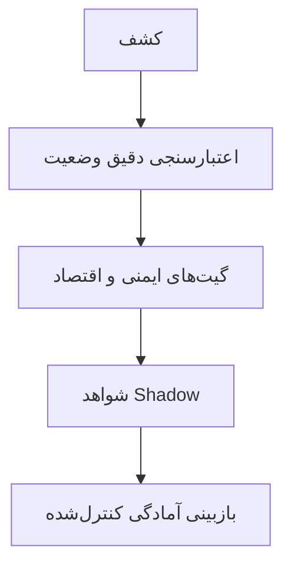

# معماری عمومی (نمای جعبه‌سیاه)

این نمودار فقط مفهوم عمومی را نشان می‌دهد و قرارداد، کد، فرمول دقیق، Threshold، مسیر Route و جزئیات عملیاتی را حذف می‌کند.

## لایه‌ها

### ۱. کشف

یک Universe گسترده از کاندیداها را پیدا می‌کند. Discovery فقط نقطهٔ شروع است و به‌تنهایی اثبات Health یا سودآوری نیست.

### ۲. اعتبارسنجی دقیق وضعیت

Market، Oracle، Borrower، Debt، Collateral و زمان را از منبع معتبر دوباره می‌خواند. اصل عمومی: کاندیدا باید از Recheck مستقل عبور کند تا به تصمیم اقتصادی برسد.

### ۳. پوشش و تازگی

یک نمای گستردهٔ مهرشده، بررسی اولویت‌دار موقعیت‌های نزدیک به ریسک و Refresh دوره‌ای ترکیب می‌شوند. پوشش مسئلهٔ Correctness است؛ Lane سریع که موقعیت مهمی را از دست بدهد موفق محسوب نمی‌شود.

### ۴. گیت‌های ایمنی و اقتصاد

هزینه، نقدشوندگی، تازگی، تغییر Context، Sizing و حداقل Net پیش از Shadow Approval بررسی می‌شوند. ورودی ناقص، قدیمی، متناقض یا Rate-limited Fail-closed می‌شود.

### ۵. شواهد

هر ادعای عمومی به تاریخ، کلاس شواهد، هویت Run و نتیجه متصل است. Artifactهای پیاده‌سازی خصوصی‌اند؛ لایهٔ عمومی نتیجه و محدودیت را ثبت می‌کند.

### ۶. بازبینی آمادگی کنترل‌شده

آمادگی مجموعه‌ای از Gateهاست، نه یک چراغ سبز. عبور فنی به‌تنهایی مجوز Signing، Broadcast یا ادعای تجاری نیست.

## اصول طراحی

- Shadow-first؛
- Fail-closed؛
- Recheck دقیق پیش از تصمیم اقتصادی؛
- جداسازی مکانیک تاریخی از نتیجهٔ زنده؛
- جداسازی خطای Provider از رد اقتصادی؛
- شواهد غیرقابل‌تغییر و عدم‌قطعیت صریح؛
- بازشدن اجرای زنده فقط با تصمیم انسانی مستقل.

