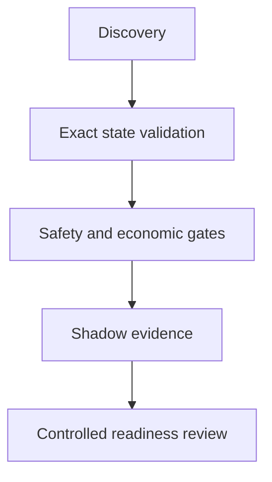

# Public architecture (black-box view)

This diagram shows the public concept only. It intentionally omits contracts, code, exact formulas, thresholds, route construction, and operational details.

## Layers

### 1. Discovery

Finds a broad candidate universe. Discovery is a starting point, not authoritative proof of health or profitability.

### 2. Exact state validation

Re-reads the relevant market, oracle, borrower, debt, collateral, and timing state from authoritative sources. The public principle is simple: a candidate must survive an independent recheck before it can reach an economic decision.

### 3. Coverage and freshness

The system combines a broad sealed view with prioritized near-risk checks and periodic refresh. Coverage is treated as a correctness problem: a fast lane that misses a relevant position is not a successful fast lane.

### 4. Safety and economic gates

Costs, liquidity, freshness, context change, sizing, and minimum-net rules are evaluated before a shadow approval. Missing, stale, contradictory, or rate-limited inputs fail closed.

### 5. Evidence

Each public claim is tied to a date, evidence class, run identity, and outcome. Raw implementation artifacts remain private; the public layer records the conclusion and its limitation.

### 6. Controlled readiness

Readiness is a sequence of gates, not a single green light. A technical pass does not authorize signing, broadcast, or commercial claims.

## Design principles

- shadow-first;
- fail-closed;
- exact recheck before economic approval;
- historical mechanics separated from live outcomes;
- provider failure separated from economic rejection;
- immutable evidence and explicit uncertainty;
- no live unlock without a separate human-controlled decision.

